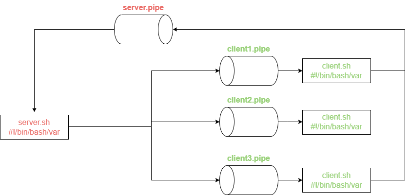

# BashDatabase
This application was created by [Sean-Jay-M](https://github.com/Sean-Jay-M).

# Architecture

*User Pipes:* Upon starting the client, a pipe is created using that users unique ID as its name. This pipe will thereafter receive all redirects from the server in relation to that specific client and pass it on to that individual client. 

*Server:* The server is the central part of the Database Management System. It connects the user to the different functions which the system does. The Server reads requests from the Server Pipe which contains the ID of the user who made the request. The server will read and execute the request.

*Server Pipe:* The server pipe is the only pipe which the server will read information from. All clients send their requests through the server pipe, alongside their command each request contains the users specific ID

# Queries

*Create database:* Will create a new directory (Database) when provided with the correct variable:

    $ ./create_database.sh *databasename* 
    OK: database created

*Create table:*  Will create a new table in a given directory (Database) it will also create the headings for any given number of columns.

    $ ./create_table.sh *databasename* *tablename* *column1,column2,column3,column4*
    OK: table created

*Insert Data:* Insert data will insert a new row or tuple into a table that exists within a database. 

    $ ./insert.sh *databasename* *tablename* *value1,values2,value3,value4*
    OK: tuple inserted

*Select Data*: Allows the user to select which columns they wish to displayed. Utilizing integers to represent the columns. It will display all tuples. 
    
    $ ./select.sh *databasename* *tablename* *integer1,integer2*
    Display Values

*Select Where*:  Allows the user to select which columns they wish to displayed, with a given value. Utilizing integers to represent the columns. It will display all tuples. 
    
    $ ./select_where.sh *databasename* *tablename* *integer1,integer2* *given_value*

*shutdown:* Server exits with code of 0.

    $ shutdown
    the server is shutting down

# Concurrency Control

Concurrency control is present in all of the scripts critical sections. Allowing for the smoothest possible usage for all users, locking processes only when necessary.

Furthermore the concurrency controls which have been put in place follow the conditions for a ‘True Solution’ as the implemented approach follows the following rules: 

•	Mutual Exclusion: One process at most inside the critical section at any time 

•	Progress: A process in execution out of a critical section cannot prevent other processes from entering it. 

If several processes are attempting to enter the critical section at the same time, the decision as to which one will enter it is not indefinitely postponed.
A process cannot remain within the critical section indefinitely.

•	Bounded Waiting: All processes attempting to enter the CS will eventually do so. 

The ways in which these requirements are met are covered under the ‘Architecture’ heading.

# How To Run

Download files to a Unix System.
Utilizing bash run server.sh and as many client.sh as required.
Use above syntax to make queries.
